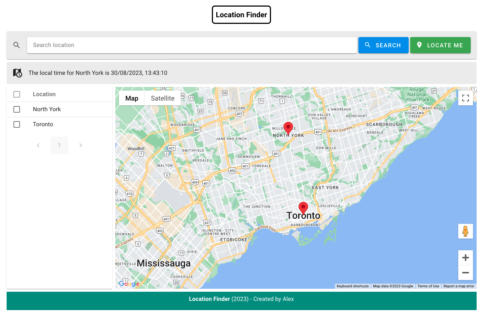

<br/>
<p align="center">
  <a href="https://github.com/alexcode4ever/location-finder">
    
  </a>

  <h3 align="center">Location Finder</h3>

  <p align="center">
    A web application allows client to search a location and show the marker on Google Map.
    <br/>
    <br/>
    <a href="https://github.com/alexcode4ever/location-finder">View Demo</a>
    .
  </p>
</p>

## About The Project



A demo project for a job application which demonstrate a web application to allow user to search a location using Google Map API and show the marker on Google Map.

## Built With

-Vue.js as javascript framework
-TailwindCSS and Vuetify as UI framework
-Pinia as state management

## Getting Started

To get a local copy up and running follow these simple example steps.

### Installation

1. Clone the repo

```sh
git clone https://github.com/alexcode4ever/location-finder.git
```

3. Install NPM packages

```sh
npm install
```

4. Run on local env

```sh
npm run dev
```

## Roadmap

See the [open issues](https://github.com/alexcode4ever/location-finder/issues) for a list of proposed features (and known issues).

## Contributing

### Creating A Pull Request

1. Fork the Project
2. Create your Feature Branch (`git checkout -b feature/AmazingFeature`)
3. Commit your Changes (`git commit -m 'Add some AmazingFeature'`)
4. Push to the Branch (`git push origin feature/AmazingFeature`)
5. Open a Pull Request

## Authors

- **[Alex](https://github.com/alexcode4ever)** - _Web developer_
